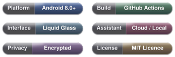

<div align="center">

# 𝓛𝓾𝓬𝓮𝓷𝓽

### Modern · Minimalist · Quietly Overqualified

**A notes-and-tasks app with an assistant that can actually touch your data —
sealed in an encrypted database on your own device, fluent in four languages, and built
from start to finish by pressing one button on GitHub and going off to put the kettle on.
It comes in pocket and desk sizes alike — an Android APK and a Windows installer — with the
same shared heart ready to travel further.**



</div>

---

## The general idea

Most note-taking apps offer you a sporting choice of two from three: the pretty one, the private
one, or the clever one. Pick any two and learn to live with the disappointment. Lucent politely
declines this arrangement. Everything you write is sealed in an encrypted database that never leaves
your device. The assistant can be a cloud model you pay for, a model running entirely on the machine
in front of you, or — if you are the sort of person who keeps notes the way one keeps a diary, which
is to say resentfully and alone — nothing at all. And the whole thing is assembled without a line of
local tooling: you press a button on GitHub, wander off, and an APK or a Windows `.exe` installer is
waiting when you return.

It is, we admit, a lot of app for a to-do list. We have made our peace with this.

## One app, wherever you put it

Lucent is **one product with a single shared heart**, and the house rule of this repository is that
every feature lands on every platform it ships to. Today that means your pocket and your desk:

- **`:app`** — the Android application (Kotlin + Jetpack Compose, Room/SQLCipher, llama.cpp via the
  NDK). Built by `.github/workflows/build.yml` into a signed release APK.
- **`:desktop`** — the desktop application, Windows today (Compose for Desktop, pure JVM, the same
  shared Kotlin de-Android-ified with a thin shim layer, SQLite over JDBC, llama.cpp compiled as a
  DLL). Built by `.github/workflows/build-windows.yml` into a double-click `.exe` installer.
- **`:shared`** — the single source tree both platforms compile. Business logic, data, most UI, one
  translation catalogue in four languages. Edit once; both platforms change.

## The assistant with hands, not merely opinions

This is the feature that defines Lucent. Bring your own model — OpenAI, Anthropic and Google request
shapes are spoken fluently, several profiles kept and switched with one tap — or run the whole thing
on the device. Say nothing at all and the assistant simply isn't there; the notes app loses nothing.

What makes the assistant worth having is that it can *act*: create, read, edit, colour, pin, archive
and delete notes; create, complete, reopen, schedule, prioritise and delete tasks; work through
checklist items item by item on notes and tasks alike; search with a real filter language; and
attach, rename or remove files. Crucially, before it changes anything it shows you precisely what it
intends — in your own language, in a dialog that is itself the editor, with every arguable field
editable before anything is written. Your answer is always the final word. Someone with an opinion and no hands is a chat; this is a butler who has been told to knock first.

Conversations go on as long as you like, switch by tapping the title, and travel with you, several
files per message included. Memory can be single-turn, per-conversation, or a digest of other
conversations; web search is a toggle, off by default and in your control.

## Notes that remember what they used to be

Every meaningful edit is snapshotted, so you can read exactly what a note said last Tuesday and
restore it when today's confident rewrite turns out to have been wrong. Type `[[Shopping list]]` and
it becomes a tappable link; point at a title that doesn't exist yet and the link glows red until a
tap politely brings the note into existence. Markdown renders when you want it and stays exactly as
typed when you don't. Checklists are first-class citizens — reword items in place, open a roomy
pop-out editor when a "quick item" develops ambitions, and nothing you typed is lost to a forgotten
plus. Tags, colours, pinning, attachments (each encrypted on disk), rich text, a doodle canvas for
thoughts words can't reach, and a private area with its own lock. Drafts sit beside the trash, so an
unfinished thought is never an abandoned one.

A blank note offers four one-tap starters — journal, meeting, project idea, checklist — and then the
real trick: templates of your own. Write one the way you like it, save it, and it greets you on every
future blank page; long-press to edit or retire any template, built-ins included.

## Tasks with due dates that actually mean something

Subtasks, priorities, repeat schedules, and reminders that survive a reboot. Due dates are parsed
from ordinary language — *next Friday at 6* becomes a genuine timestamp with a genuine alarm — and
repeat cadences are first-class rather than a clever sentence that eventually gives up. Marking a
task complete ticks its whole checklist off with it; completed tasks take themselves off to their
own screen.

## Or run the whole thing on the device itself

Import a `.gguf` file (or a `.zip` with one inside, which is unpacked for you) and the assistant
answers using llama.cpp running directly on the device — no account, no API key, no network, and
the model is unloaded the moment you leave the app. Roughly 1–4 GB Q4 models hit the sweet spot on a
phone; a desktop can afford more optimism. Tools are opt-in in local mode and GPU acceleration is a
choice made after a plain warning; the CPU always works, and a GPU that disagrees falls back
gracefully. Vision is optional too: import an mmproj file and the assistant will look at a photograph and
discuss it like a mildly clairvoyant librarian.

## Four languages, switched without ceremony

English, 中文, 日本語, 한국어 — every screen, dialog, date format and template. Switch the language
and the whole app follows on the same frame, because there is one translation catalogue and it is
what the UI reads.

## The look of it: made, unashamedly, of glass

Soft blobs of colour drift behind frosted panels that blur whatever passes beneath them, on a
background that keeps its own schedule, so the blobs drift at their own pace even when the page
under them is sprinting. A generous spread of palettes across eight style families, with an
auto-cycle or random companion that ambles through them in smooth transitions. Light, dark, system,
and a gallery of Monet-tinted themes — and on Android 12+ the palette can politely borrow your
wallpaper's plan for the day. Widgets bring the same glassy surface to your launcher; on Windows the
app slips into the tray and the sidebar takes over from the bottom tab bar, because a large monitor
deserves better than a phone layout stretched sideways.

## The lock that counts, and the backup that leaves with you

The app lock is a real brute-force policy, not a polite request: escalating cooldowns, a persisted
counter that survives reboots, an optional security question, an optional self-destruct, and a
fingerprint (Android) or Windows Hello (Windows) that is politely out of office for the whole
cooldown. The database is encrypted at rest; attachments are encrypted individually; backups are a
single password-protectable `.lcb` file carrying notes, tasks, history, chats, attachments and
settings across devices, previewed before a single item is changed, and armed to run automatically.

## Privacy that is structural, not merely promised

Nothing leaves the device until you export it or give a model a reason to look. Share-sheet
integration is off by default; diagnostics are off by default and locally kept; the assistant
services you connect are entirely your choice; and the one deliberate exception to encryption —
exporting to Markdown, Word, PDF or Excel — is a file you can open anywhere else, which is the whole
point. Good manners and good safety tend to arrive together.

## Rust, but only where it earns its keep

Two hot paths are written in Rust and reached through JNI —
the PBKDF2 and AES-256-GCM routines behind backups and attachment encryption, and the maths behind
the drifting background. Both fall back to identical Kotlin automatically when the native library
isn't present.

## Building it (yes, from a phone, in your dressing gown)

No Android Studio, no local SDK, no command line. Push to GitHub, open **Actions**, run the workflow
you want, and download the result — a properly signed release or a double-click installer — with the
workflows themselves living in the repository, so the build is as inspectable as the code.

## Project layout

```
shared/       THE single shared source tree — business logic and most UI live here ONCE, and both
              :app and :desktop compile it. Edit a file here to change both platforms together.
app/          Android module (:app) — Activity shell, Room database layer, JNI bridges, widgets,
              and other genuinely Android-bound code only
desktop/      Desktop module (:desktop) — Compose for Desktop shell, the android.* JVM shims,
              the JDBC database core, native CMake build for the engine DLL
rust/         The Rust accelerator (shared across platforms)
.github/      build.yml (Android APK) and build-windows.yml (Windows installer)
```

## Toolchain

Everything builds on the newest official versions of the stack: Gradle 9.7.1, AGP 9.4.0, Kotlin
2.4.0, KSP 2.3.11, Compose Multiplatform 1.12.0, NDK 28.2. Android compiles against API 36, with
Android-facing dependencies pinned to the newest versions whose AAR metadata accepts it.

## What stays per platform, and why

`shared/` holds everything that can be shared. A short list of files deliberately remains once per
platform, each for a real reason, and it never grows on purpose: `SettingsRepository` (Android
DataStore vs desktop preferences), `Daos`/`Db` (Room vs JDBC), `Entities` (Room annotations),
`DocumentExport` (PdfDocument vs PDFBox), and the large screens whose platform seams run deep.
Whenever one of those seams can be removed, it is — the single-point rule is the default, and the
exceptions are the ones listed here.

## With thanks to the giants whose shoulders these are

Underneath the glass, Lucent is a great deal of other people's excellent work. It would be poor
manners — and, in one or two cases, an outright licence violation — not to say so out loud. The full
texts and copyright notices live in **[`THIRD-PARTY-NOTICES.md`](./THIRD-PARTY-NOTICES.md)**; the
short version, with our gratitude, is this:

| Borrowed brilliance | Doing the job of | Under |
|---|---|---|
| [Kotlin](https://github.com/JetBrains/kotlin) & [Coroutines](https://github.com/Kotlin/kotlinx.coroutines) | the language, and its patience with concurrency | Apache-2.0 |
| [Jetpack Compose & AndroidX](https://developer.android.com/jetpack/androidx) | the Android half of the interface | Apache-2.0 |
| [Compose Multiplatform & Skiko](https://github.com/JetBrains/compose-multiplatform) | the desktop half of the interface | Apache-2.0 |
| [Material Icons](https://github.com/google/material-design-icons) | the small pictures that mean things | Apache-2.0 |
| [Haze](https://github.com/chrisbanes/haze) — © Chris Banes | all that fashionable blur | Apache-2.0 |
| [OkHttp](https://github.com/square/okhttp) — © Square, Inc. | talking to the cloud | Apache-2.0 |
| [Apache PDFBox](https://pdfbox.apache.org/) | PDFs on the desktop | Apache-2.0 |
| [SQLite JDBC](https://github.com/xerial/sqlite-jdbc) — © Taro L. Saito et al. | the desktop's way into SQLite | Apache-2.0 |
| [SQLite](https://www.sqlite.org/) | the database itself, quietly running the world | Public Domain |
| [SQLCipher](https://www.zetetic.net/sqlcipher/) — © Zetetic LLC | the lock on that database, on Android | BSD-style |
| [llama.cpp & GGML](https://github.com/ggml-org/llama.cpp) — © Georgi Gerganov & contributors | an entire language model, on your own silicon | MIT |
| [org.json](https://github.com/stleary/JSON-java) — © JSON.org | reading JSON on the desktop | JSON License |

### And the notes apps we studied

Six mature notes-and-tasks applications were read, poked, and taken to tea for this project — not
for their code, which Lucent does not bundle, but for the things their authors figured out first.
Their fingerprints are on Lucent's structure and its manners, rather than on its binaries, and a
design debt repaid loudly is the least we can do:

| Studied for | What Lucent borrowed | Their words |
|---|---|---|
| [Quillpad](https://github.com/quillpad/quillpad) | the two-level drawer — pin where you can reach it, configuration one level down | GPL-3.0 |
| [Omni-Notes](https://github.com/federicoiosue/Omni-Notes) | the honesty of system pickers and long-press actions that explain themselves | GPL-3.0 |
| [OpenNote-Compose](https://github.com/YangDai2003/OpenNote-Compose) | the dynamic-colour priority model — wallpaper first, stored choices never destroyed | GPL-3.0 |
| [AppFlowy](https://github.com/AppFlowy-IO/AppFlowy) | saying what is happening in the open, in the settings page and elsewhere | AGPL-3.0 |
| [Logseq](https://github.com/logseq/logseq) | that a notes app should feel like a place, not a dashboard | AGPL-3.0 |
| [MarkLeaf](https://github.com/jeiel85/markleaf-android) | that the editorial surface stays calm while the configuration waits its turn | Apache-2.0 |

Lucent's own licence governs everything you install; the projects above are honoured as sources of
ideas and arrangements, not as included works. The structure is ours; the courtesy is theirs.

A particular word for **SQLCipher**, whose BSD-style licence asks — not unreasonably, given it is
the thing keeping your diary shut — that its copyright and notice be reproduced somewhere a user can
actually find them. So they are, in the notices file above; if you ship a build of Lucent, keep them
findable. Fonts, incidentally, no longer appear in that table at all: Lucent bundles none, and the
ones you import stay your own files under whatever terms you hold them.

## Licence, and the one small thing it asks in return

Lucent is released under the **MIT Licence** — see [`LICENSE`](./LICENSE). Do very nearly whatever
you like with it: use it, change it, fold it into something commercial, build something better on
top and never write to thank us. The single, entirely reasonable condition is that our copyright
notice and the licence text come along for the ride in any copy or substantial portion of the code —
so if you reuse Lucent, keep the `LICENSE` file (and the name on it) with what you ship, and we are
square. The third-party components above make their own, similarly modest requests; honour those in
the same spirit and everyone stays friends.

## Contributing

Should you be seized by the urge to improve Lucent, we should be quietly delighted. Bug reports, thoughtful suggestions, and pull requests submitted with good grace are entirely welcome. We ask only that everyone remain strictly civil, keep the tea warm, and treat fellow contributors with the courtesy one expects in a respectable reading room.
