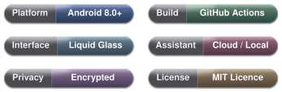

[🇬🇧 English](../README.md) · [🇯🇵 日本語](./README.ja.md) · [🇰🇷 한국어](./README.ko.md)

<div align="center">

# 𝓛𝓾𝓬𝓮𝓷𝓽

### 现代 · 极简 · 内敛至近乎沉默

**一款笔记与任务管理应用，内置一位真正能触及你数据的助手——一切内容静栖于设备之上、封存在加密数据库之中。通晓四国语言，在 GitHub 上一键即可完成构建。口袋版与桌面版，Android APK 与 Windows 安装包——共享同一颗跳动的心脏，随时整装待发、行更远的路。**



</div>

---

## 总体思路

市面上绝大多数笔记应用，迫你在三样好东西里割舍其一：美观、私密、聪慧——取其二，余者付之阙如。Lucent 不作此交易。你落笔的一切都封存于加密数据库，寸字不离设备。助手可以是你付费订阅的云端模型，可以是运行在眼前这台机器上的本地模型，也可以干脆从缺——应用本身丝毫不因此逊色。更妙的是，构建过程不要求你本地安装任何工具：在 GitHub 上按一个按钮，去泡杯茶，回来时一只 APK 或一份 Windows 安装包已安然等候。

## 一个应用，放哪儿都行

Lucent 是**一件产品、一颗共享的心脏**：铁律如此——凡有功能，必登一切已发布的平台。口袋与桌面，说同一种语言：

- **`:app`** —— Android 应用（Kotlin + Jetpack Compose，Room + SQLCipher，通过 NDK 调用 llama.cpp）。由 `.github/workflows/build.yml` 构建为签名的 Release APK。
- **`:desktop`** —— 桌面应用，目前面向 Windows（Compose for Desktop，纯 JVM，JDBC 调用 SQLite，llama.cpp 编译为 DLL）。由 `.github/workflows/build-windows.yml` 构建为双击即装的 `.exe` 安装包。
- **`:shared`** —— 两个平台共同编译的同一棵源码树：业务逻辑、数据层、大部分界面，以及一份涵盖四种语言的翻译目录。改一处，两端同变。

能共享者悉居 `shared/`；确实无法共享者——`SettingsRepository`、`Daos`/`Db`、`DocumentExport` 以及若干最大的界面——各平台各留一份，因为它们的边界嵌入太深。每个原生构建阶段皆可选，因而某一环节出故障时，你收到的是一份能用的应用，而非一间候诊室。

## 有手——而非只有意见——的助手

此乃 Lucent 定义性的功能。自带模型——OpenAI、Anthropic 和 Google 的请求格式皆能从容应对，可保存多组配置、一键切换——或索性在设备上全本地运行。什么都不配，助手便不存在；笔记应用本身依然完备如初。

使其真正值得拥有的，是它能*动手*：创建、读取、编辑、标色、置顶、归档、删除笔记；创建、完成、重开、排期、设定优先级的任务；用真正的过滤语言进行搜索；以及附加、重命名或删除文件。在触动任何数据之前，它会精确地向你展示意图——用你的语言，在一个本身即是编辑器的对话框里，每一个待定字段在你确认之前皆可修改。你的回答永远是终审裁决。一个有意见而无手的东西叫聊天；这是一位被教导先敲门的管家。

对话绵延不绝、随你而行；模型的推理过程可展开为可折叠的轨迹，每行对应一次工具调用。

## 记得自己前世的笔记

每一次有意义的编辑都被快照留存，因而你能精确回溯某条笔记曾经的模样，并在某次信心满满的重写被证明过于冒进时，将它完璧归赵。输入 `[[购物清单]]`，即成为一个可点击的链接；若所指标题尚不存在，链接会以红色示警，直到你点击——笔记便应声而生。Markdown 在你需要时渲染，在你不需要时保持素颜。复选框是头等公民：原地修改条目，当一条小条目骤然萌生大志时，打开一个宽敞的弹出编辑器。标签、颜色、置顶、单独加密的附件、富文本、一方为灵感留白的涂鸦画布，以及一个自带独立门锁的私密区域——还有垃圾桶旁的草稿箱，让未竟之思永远不至于沦为弃子。

空白笔记默认提供四个一键模板——日记、会议、项目创意、清单——而后才是真正的妙笔：你自己的模板。保存一个，今后每一次打开空白页时它都会含笑相迎；长按可编辑或淘汰任何模板，内置的也不例外。

## 真正有意义的截止日期

子任务、优先级、重复周期，以及重启后依然屹立的提醒。截止日期从自然语言解析——*下周五6点*变成一枚真实的时间戳与一声真实的闹铃——重复节奏是一等公民，而非一句终将食言的许诺。完成一项任务，它连带整条复选框一并勾去，已完成的任务自动迁往一个专属屏幕，各得其所。

## 或者，直接在设备上跑全套

导入一个 `.gguf` 文件（或一个内含 `.gguf` 的 `.zip`），助手便借由直接运行在设备上的 llama.cpp 作答——无账号、无 API 密钥、无网络，你离开应用的瞬间模型即被卸载。约 1–4 GB 的 Q4 模型在手机上恰如其分；桌面端则可放手更为大胆。工具函数在本地模式下需手动开启，GPU 加速在一条直白的警告之后方可选择：CPU 始终可靠，而 GPU 若意见不合，会优雅地退回。视觉能力亦属可选——导入一个 mmproj 文件，助手便能审视一张照片，然后以一位略具预知力的图书管理员的口吻与你讨论它。

## 四种语言，无缝切换

英语、简体中文、日本語、한국어——覆盖每一个屏幕、对话框、日期格式与模板。切换语言，整个应用在同一帧内随之流转，因为只有一份翻译目录，界面所读即是它所取：每个词条仅存一次，此乃架构的必然，而非细心的偶得。

## 它的样子：坦荡磊落，玻璃质感

一道流动的渐变在毛玻璃面板后方悠然漂移，模糊着它下方掠过的一切，几乎从不重复，以设备预先应允的代价运行。八个风格系列，丰盛到近乎奢靡的调色板，还有一个自动循环或随机漫步的陪伴功能，在其间从容穿行。浅色、深色、跟随系统，以及一系列 Monet 色调的主题——在 Android 12 及以上版本，调色板会借用你壁纸当日的配色方案。小部件将同样的玻璃质感延伸至你的启动器；在 Windows 上，应用隐入系统托盘，侧边栏取代底部标签栏——因为一面宽阔的显示器理应得到比手机布局横向拉伸更优雅的礼遇。

## 算数的锁，与你同行的备份

应用锁是一道真正的暴力破解防线，而非一句客套的请求：递增的冷却时间、重启后依然存续的计数器、一个可选的安全问题、一个可选的自毁机制，以及冷却期间礼貌告退的指纹识别（Android）或 Windows Hello（Windows）。数据库静态加密，附件独立加密。备份是一个受密码保护的 `.lcb` 文件，携笔记、任务、历史、聊天、附件与设置跨设备迁移——在改动任何一条数据之前先供你预览，且可设为自动执行。一份谁也读不了的备份叫纪念品，不叫备份——因此这份备份在导出时可读，在导入时亦可读。

## 结构性隐私，而非仅仅承诺

在你自己主动导出或给模型一个查看的理由之前，没有任何东西离开设备。分享面板集成默认关闭；诊断信息默认关闭且留存本地；你连接的助手服务完全由你抉择；云同步是一个你自行配置的模块，经由 WebDAV。加密唯一有意的例外——导出为 Markdown、Word、PDF 或 Excel——正是为了你能在任何其他地方打开这些文件，这恰恰是它存在的意义。

## Rust，但只在它值得的地方

两条热点路径以 Rust 编写，经 JNI 调用——备份与附件加密背后的 PBKDF2 及 AES-256-GCM 例程，以及流动背景背后的数学运算。两者都在原生库不可用时回退到功能完全一致的 Kotlin 实现，因此应用永远不会被编译器的脾气所绑架。

## 构建它（没错，穿着睡衣在手机上就能搞）

不需要 Android Studio，不需要本地 SDK，不需要命令行。推送到 GitHub，打开 **Actions**，运行你想要的 workflow，下载结果——一个正确签名的 Release APK，或一个双击即装的安装包。Workflow 文件就存放在仓库里，因此配方就在盒子里，而非在作者的脑子里；构建过程与代码一样，可供审查。

## 项目结构

```
shared/       唯一的共享源码树。业务逻辑与大部分界面在此只写一次，
              :app 和 :desktop 皆编译它。改一个文件，两个平台同变。
app/          Android 模块 (:app) — Activity 壳、Room 数据库层、JNI 桥、小部件，
              以及其他真正绑定 Android 的代码
desktop/      桌面模块 (:desktop) — Compose for Desktop 壳、android.* 的 JVM 垫片、
              JDBC 数据库核心、引擎 DLL 的原生 CMake 构建
rust/         Rust 加速器（跨平台共享）
.github/      build.yml（Android APK）、build-windows.yml（Windows 安装包）、check.yml
```

## 它下一步要去哪

Lucent 于一张待办清单而言未免过于庞大，而它从未为此致歉。有记忆的笔记、有锋芒的任务、有双手且知礼的助手、信守其诺的加密、值得驻目的界面。用一周试探它，看你注意到什么；用一个月磨合它——然后你会发觉，你已浑然不觉它的存在。

## 感谢这些巨人，我们站在他们肩上

在玻璃表面之下，Lucent 是众多他人卓越工作的结晶。不将这些言明，既失礼数——在某些情形下，更是直接的许可证违规。完整文本与版权声明请见 **[`THIRD-PARTY-NOTICES.md`](./THIRD-PARTY-NOTICES.md)**；简版连同我们的感激之情，列于下方：

| 借来的才华 | 负责的工作 | 许可证 |
|---|---|---|
| [Kotlin](https://github.com/JetBrains/kotlin) & [Coroutines](https://github.com/Kotlin/kotlinx.coroutines) | 这门语言，以及它对并发的耐心 | Apache-2.0 |
| [Jetpack Compose & AndroidX](https://developer.android.com/jetpack/androidx) | Android 那半边界面 | Apache-2.0 |
| [Compose Multiplatform & Skiko](https://github.com/JetBrains/compose-multiplatform) | 桌面那半边界面 | Apache-2.0 |
| [Material Icons](https://github.com/google/material-design-icons) | 那些有含义的小图标 | Apache-2.0 |
| [Haze](https://github.com/chrisbanes/haze) — © Chris Banes | 那一切时髦的模糊效果 | Apache-2.0 |
| [OkHttp](https://github.com/square/okhttp) — © Square, Inc. | 和云端对话 | Apache-2.0 |
| [Apache PDFBox](https://pdfbox.apache.org/) | 桌面上的 PDF 处理 | Apache-2.0 |
| [SQLite JDBC](https://github.com/xerial/sqlite-jdbc) — © Taro L. Saito et al. | 桌面端访问 SQLite 的方式 | Apache-2.0 |
| [SQLite](https://www.sqlite.org/) | 数据库本身，安静地运行着世界 | Public Domain |
| [SQLCipher](https://www.zetetic.net/sqlcipher/) — © Zetetic LLC | Android 端数据库上的那把锁 | BSD-style |
| [llama.cpp & GGML](https://github.com/ggml-org/llama.cpp) — © Georgi Gerganov & contributors | 一整个语言模型，跑在你的芯片上 | MIT |
| [org.json](https://github.com/stleary/JSON-java) — © JSON.org | 桌面上读取 JSON 格式 | JSON License |

### 以及我们研究过的笔记应用

为了这个项目，六款成熟的笔记与任务应用被阅读、被戳弄、被请去喝了茶——不是为了它们的代码（Lucent 并未打包这些代码），而是为了它们的作者们率先摸索出来的那些智慧。它们的指纹留在了 Lucent 的结构与礼仪上，而非它的二进制文件里；高声偿还一笔设计债务，是我们至少能做的：

| 研究对象 | Lucent 借鉴了什么 | 它们的许可证 |
|---|---|---|
| [Quillpad](https://github.com/quillpad/quillpad) | 双层抽屉——常用功能置顶放在手边，配置项在下一层 | GPL-3.0 |
| [OpenNote-Compose](https://github.com/YangDai2003/OpenNote-Compose) | 动态色彩优先级模型——壁纸优先，已有配色方案永不破坏 | GPL-3.0 |
| [Omni-Notes](https://github.com/federicoiosue/Omni-Notes) | 系统选择器的坦诚，以及自解释的长按操作 | GPL-3.0 |
| [AppFlowy](https://github.com/AppFlowy-IO/AppFlowy) | 在设置页面和其他地方，把正在发生的事情公开说出来 | AGPL-3.0 |
| [Logseq](https://github.com/logseq/logseq) | 笔记应用应该像一个地方，而不是一个仪表盘 | AGPL-3.0 |
| [MarkLeaf](https://github.com/jeiel85/markleaf-android) | 编辑界面保持冷静，配置页面安静地等着轮到自己 | Apache-2.0 |

Lucent 自身的许可证管辖你安装的一切；上述项目作为创意与组织方式的来源受到尊重，而非作为被包含的作品。结构是我们的；礼数是它们的。

特别要提一下 **SQLCipher**，它的 BSD 风格许可证要求——考虑到它正是替你锁好日记的那个东西，这个要求并不过分——它的版权声明和声明文本应该被复现在用户能够实际找到的地方。所以我们照做了，就在上面的声明文件里；如果你分发 Lucent 的构建版本，请确保这些声明依然可被找到。

## 许可证，以及它要求的唯一一件小事

Lucent 以 **MIT 许可证** 发布——见 [`LICENSE`](../LICENSE)。你可以对它做几乎任何你喜欢的事：使用它、修改它、把它塞进商业产品、在它之上构建更好的东西，且永远不必写信致谢。唯一一个完全合理的要求是：我们的版权声明与许可证文本须随任何副本或实质性部分的代码一同传播——因此若你复用了 Lucent，请把 `LICENSE` 文件（以及上面的署名）连同你分发的成果一并带上，我们便两讫了。上述第三方组件也各有其类似的、谦和的要求；以同样的精神尊重它们，大家便依然是朋友。

隐私政策：**[`PRIVACY/PRIVACY.zh-CN.md`](https://github.com/Yuan0-o/Lucent/blob/main/PRIVACY/PRIVACY.zh-CN.md)** —— Lucent 在本机保存什么、什么会离开设备，以及每一项由你掌握的控制。

## 贡献

若你忽然涌起一股改进 Lucent 的冲动，我们会暗自欣喜。Bug 报告、有见地的建议、以及以良好风度提交的 Pull Request，一概欢迎。我们只有一个请求：所有人须保持严格得体的举止，茶水保持温热，并以你在一间体面的阅览室里期望的那种礼节来对待每一位贡献者。
